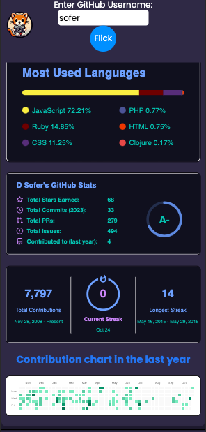
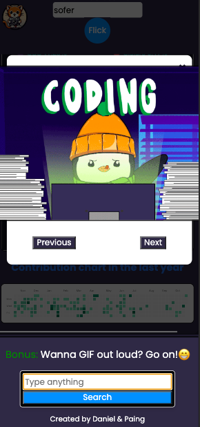
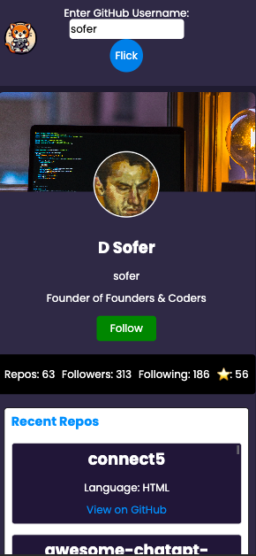
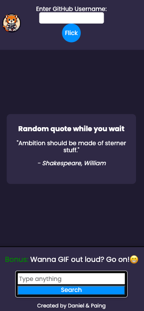

# 🐙 GitFlick

Tired of GitHub's black & white interface?
Welcome to `GitFlick`! A fun and interactive application that offers a fresh perspective on GitHub users by mashing up data from Unsplash, GitHub, GIPHY API, and Ninjas API.
Search any GitHub profile name on GitFlick and enjoy a reimagined profile view that's both stylish and interactive.

🔗 [Try GitFlick](https://fac29a.github.io/GitFlick/)

<table>
  <tr>
    <td>
      
    </td>
    <td>
      
    </td>
  </tr>
  <tr>
    <td>
      
    </td>
    <td>
      
    </td>
  </tr>
</table>


## Creators:

- [Daniel](https://github.com/DanielMA7)
- [Paing](https://github.com/Paing-Ko)


## User Stories

### Core features

As a user, you will get:

1. **View a Splashy GitHub Profile:** Experience a colorful and dynamic GitHub view on GitFlick, complete with language and contribution charts.

2. **Random Quotes:** With the integration of Ninjas API, enjoy a fresh quote on home page.
3. **Search with GIPHY:** Interact with the app and search for entertaining GIFs, and navigate through them using previous/next buttons.

4. **Experience a Responsive Design:** GitFlick boasts a mobile-first, responsive design, ensuring seamless functionality across devices and screen sizes, and is also optimized for screen reader users.


### Stretch features

We provide our users with some extra features:

1. **Loading Indicators:** To cater to impatient users, loading indicator(Flick button) or messages have been implemented to keep users informed while data is being fetched from the APIs.

2. **Error Handling:** In the event of issues with data retrieval or app functionality, clear error messages and feedback are provided to guide and inform users.


### Extra Features

We added extra features that go beyond the project requirements.
1. **GitHub follow button:** Users can follow an individual's profile using GitFlick.
2. **Filter,Sort,View Repos:** Users can explore repositories; filtering by language or sorting them by name or recent activity.


## APIs

- **Unsplash**: Provides the vast library of diverse images. 
  - [View Documentation](https://unsplash.com/documentation)
- **GitHub**: Powers the core feature of fetching GitHub user data.
  - [View Documentation](https://docs.github.com/en/rest)
- **GIPHY**: The source of the entertaining GIFs that users can search for.
  - [View Documentation](https://developers.giphy.com/docs/api/)
- **Ninjas API**: Provides quotes that are displayed on the loading page.
  - [View Documentation](https://api-ninjas.com/api/quotes)


## How to Use GitFlick

1. Clone the repo:
   ```bash
   git clone https://github.com/fac29a/GitFlick.git
   ```
2. Navigate into the directory:

   ```bash
   cd GitFlick
   ```

3. Open index.html in your browser.

   ```bash
   open index.html
   ```

4. Dive in, start exploring, and enjoy your colorful GitHub experience!

Enjoy your experience with GitFlick and feel free to contribute to our project!


